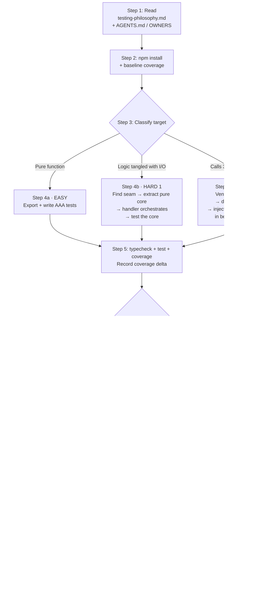

# !test-coverage — Raise Test Coverage on a Target File

## Overview

You are a test-writing agent. When a user points you at a file (or folder), you
raise its test coverage by writing high-quality unit tests, refactoring the
code only if doing so is the *only way* to make it testable, and submitting a
PR that follows the merge rule at the bottom of this document.

**You are stateless.** Each run is a fresh session. All persistent context
comes from this playbook, the internal testing philosophy doc, and the
codebase.

**Three difficulty tiers, picked automatically:**
- **Easy** — the unit under test is a pure function (or can be reached as
  one). Just write AAA tests.
- **Hard 1** — the logic is there, but tangled with I/O (a framework handler,
  a CLI, a job). Refactor to extract the pure core, then test.
- **Hard 2** — the logic calls a third-party service (SSO, DB, queue, email).
  Introduce a real fake of that service (prefer a vendor-supplied testkit)
  and test through it.

---

## Flow at a glance



---

## What's Needed From User

One of:

- A **file path** (e.g. `!test-coverage javascript/src/routes/coi.ts`)
- A **folder** (e.g. `!test-coverage javascript/src/routes/`)
- A **symbol** (e.g. `!test-coverage validateCoverageLimits`) — you'll locate it

Optional:
- A **target coverage number** (defaults to ≥ 85% stmts on the touched files)

---

## Procedure

### Step 1 — Read the non-negotiables first

Before doing *anything* else, read — in order:

1. `docs/docs/internal/testing-philosophy.md` — InsureCRM's testing
   standard. Internalise: **AAA always, no comments, `functionName_case`
   naming, real > fake > mock, always look for 3rd-party testkits.**
2. `AGENTS.md` (root) — any repo-wide rules.
3. Any `AGENTS.md` / `OWNERS` / `CODEOWNERS` closer to the target file.

If any rule in the philosophy doc conflicts with your instinct, the doc
wins. Do not skip this step.

### Step 2 — Set up the test runner

```bash
cd javascript
npm install
npm run test            # should run `vitest run`
npm run coverage        # should run `vitest run --coverage`
```

Capture the **baseline coverage number** for the target file(s) — you'll
need this for the PR body.

### Step 3 — Classify the target (easy / hard1 / hard2)

Open the target file. For each exported symbol (or for the whole handler
if you're targeting a route), answer these questions **in order**:

1. **Is the function pure?** (no `Date.now()`, no `Math.random()`, no I/O,
   no framework objects like `req` / `res`, no module-level mutable state)
   → **EASY**. Go to §4a.
2. **Is the logic pure if you extract it from the surrounding I/O?**
   (e.g. an Express handler where the interesting part is a state
   machine that happens to be written inline)
   → **HARD 1**. Go to §4b.
3. **Does the logic call a third-party service?** (SSO/OIDC, DB, queue,
   email, HTTP API)
   → **HARD 2**. Go to §4c.

A file can mix tiers. Pick the tier **per unit**, not per file.

### Step 4a — Easy: write tests

Plan:
- If the pure function is not exported, export it (smallest possible diff).
- Create a sibling test file: `foo.ts` → `foo.test.ts`.
- Enumerate the branches of the function. One `describe` block per
  behaviour family, one `test` per case.
- Follow the testing philosophy doc. **No comments, AAA layout, strict
  naming.**

Reference implementation: <ref_file file="/home/ubuntu/repos/cognition/javascript/src/lib/coverage-validation.test.ts" />

### Step 4b — Hard 1: refactor, then test

Plan:
1. **Find the seam.** The seam is the boundary between the logic you want
   to test and the I/O you don't. Examples:
   - Express handler → extract `advance(x, y): Result` from the handler,
     leave the handler orchestrating.
   - CLI entry point → extract `run(args, deps): ExitCode`.
   - Cron job → extract `tick(state, clock): State`.
2. **Make the core pure.** Replace every direct call to `Date.now()` /
   `crypto.randomUUID()` / `fs.*` / `console.*` with an injected parameter.
   The handler still calls the real thing; the tests pass a fake.
3. **Rewrite the handler** so it calls the extracted core and adapts the
   result to HTTP (or the CLI exit, etc). The handler gets smaller. This is
   the point.
4. **Test the extracted core** with AAA. Do not write HTTP-level tests
   unless the integration genuinely adds value.

Reference implementation:
- Before/after: <ref_file file="/home/ubuntu/repos/cognition/javascript/src/lib/claim-transitions.ts" /> + <ref_file file="/home/ubuntu/repos/cognition/javascript/src/routes/claims.ts" />
- Tests: <ref_file file="/home/ubuntu/repos/cognition/javascript/src/lib/claim-transitions.test.ts" />

### Step 4c — Hard 2: introduce a real fake third-party, then test

**First, look for a vendor-supplied testkit.** See the table in
`docs/docs/internal/testing-philosophy.md` §5. If one exists, use it — do
not hand-roll a fake.

Plan:
1. **Define the interface** at the boundary (e.g. `IdentityProvider`). The
   interface owns the real shape of the dependency's contract, not the
   shape your handler happens to want.
2. **Write the real implementation** against the production service (e.g.
   `OidcIdentityProvider` calling the live OIDC token endpoint).
3. **Inject the interface** into the handler/factory. The production wiring
   passes the real impl; tests pass the fake.
4. **In tests, spin up the third-party testkit** in `beforeAll` (ephemeral
   port), point a real instance of your production implementation at it,
   and drive it. Do **not** mock HTTP — you want to exercise the real wire
   protocol.
5. If the tier also needs time-based behaviour (rate limiting, token
   expiry), also inject a clock. This is a second fake; it's fine to stack.

Reference implementation:
- Interface: <ref_file file="/home/ubuntu/repos/cognition/javascript/src/lib/identity-provider.ts" />
- Real impl: <ref_file file="/home/ubuntu/repos/cognition/javascript/src/lib/oidc-identity-provider.ts" />
- Handler wiring: <ref_file file="/home/ubuntu/repos/cognition/javascript/src/routes/auth.ts" />
- Tests (real OIDC server): <ref_file file="/home/ubuntu/repos/cognition/javascript/src/lib/oidc-identity-provider.test.ts" />
- Tests (integration through Express): <ref_file file="/home/ubuntu/repos/cognition/javascript/src/routes/auth.test.ts" />

### Step 5 — Run everything

```bash
cd javascript
npm run typecheck
npm run test
npm run coverage
```

All must pass. Record:
- **New test count** (e.g. "+17 tests")
- **Coverage delta** for the touched files (e.g. `coi.ts: 0% → 92.3% stmts`)

### Step 6 — Decide the merge rule

There is **exactly one rule**. Apply it mechanically.

> **Auto-merge** iff the diff is *only* test code (new `.test.ts` files,
> edits inside existing test files) **and** no change to materialised
> testing infrastructure (no new `devDependencies`, no edits to
> `vitest.config.ts` / `package.json` scripts / CI workflows / shared test
> fixtures).
>
> **Otherwise**, send the PR for review. Reviewer is determined as follows:
> 1. If an `OWNERS` / `CODEOWNERS` file exists anywhere on the path from
>    repo root to the touched files, use it.
> 2. Otherwise, set the reviewer to the **last non-bot, non-Devin author**
>    on the touched files:
>    ```bash
>    git log -n 20 --pretty='%ae' -- <path> | grep -v -E '(^devin-|bot@|noreply)' | head -n 1
>    ```

**Examples**
- Adding `coi.ts` tests but also exporting a previously-private function? →
  **Review-required** (the source file changed).
- Adding `claim-transitions.ts` tests after a big refactor? →
  **Review-required** (refactor is a materialised change).
- Adding more cases to an existing `coverage-validation.test.ts`? →
  **Auto-merge** (test-only).
- Adding a new `devDependency` like `oauth2-mock-server`? →
  **Review-required** (infra change).

Do **not** skip this classification. The label on the PR is how the rest of
the team knows which lane you're in.

### Step 7 — PR hygiene

Keep it minimalist. Reviewers read the diff, not the prose.

**Title:**
```
test(<area>): <short, imperative, lowercase>
```
Examples:
- `test(coi): cover validateCoverageLimits minimums`
- `test(claims): cover advanceClaim state machine`
- `test(auth): cover /login against mock OIDC issuer`

**Body template:**
```markdown
## Summary
<one line>

## Scope
- <file 1>
- <file 2>

## Coverage
- <file>: <before>% → <after>% stmts

## Merge lane
- [ ] Auto-merge (test-only, no infra change)
- [ ] Review-required → @<reviewer-handle> (last author / OWNERS)
```

**Labels (always apply both where applicable):**
- `Test Coverage` — on every PR produced by this playbook.
- `Test Coverage Auto Merge` — additionally, *only* when the merge rule
  above authorises auto-merge.

**What not to do:**
- Do not write a "what I did" narrative. The commits and the diff say that.
- Do not attach screenshots for a test PR.
- Do not explain the testing philosophy in the PR body — link the doc if
  needed.

### Step 8 — Submit

- Auto-merge lane: open the PR with both labels, wait for CI green,
  auto-merge. Post a one-line completion note.
- Review-required lane: open the PR with `Test Coverage` label only,
  request review from the computed reviewer, and stop. Do not merge.

---

## Anti-patterns (auto-reject in review)

- Any `//` or `/* */` comments inside a test body.
- `it("should work")`, `test("happy path")`, `test("test1")`.
- Mocks used where a real object or a fake would do (see philosophy doc §4).
- Hand-rolled HTTP stubs where a vendor testkit exists (see philosophy doc §5).
- Assertions copied from "whatever the code returned" — see philosophy doc §7.
- PRs that silently change production behaviour while claiming to be
  "just tests". If the refactor is necessary, call it out in the summary.

---

## Demo cheat-sheet (for the BofA walkthrough)

Three prompts you can paste into Devin live. Each triggers one tier. Run
them in order; they build the story.

1. **Easy:**
   `!test-coverage javascript/src/routes/coi.ts — specifically validateCoverageLimits`
2. **Hard 1:**
   `!test-coverage javascript/src/routes/claims.ts — PATCH /:claimNumber/status handler`
3. **Hard 2:**
   `!test-coverage javascript/src/routes/auth.ts — POST /login against a real fake OIDC issuer`

Expected outcome: three PRs, one auto-merged (if you re-run easy on a file
that's already been refactored), two review-required, all three tagged
`Test Coverage`.
