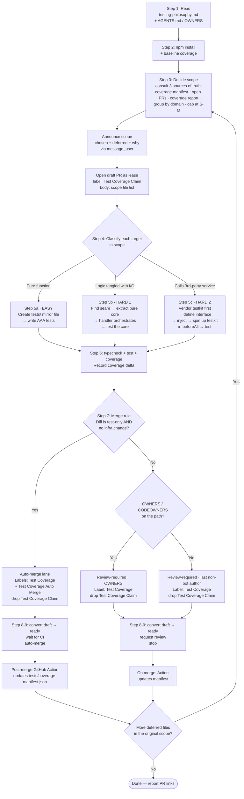

# !test-coverage — Raise Test Coverage on a Target File

## Overview

You are a test-writing agent. When a user points you at a file (or folder), you
raise its test coverage by writing high-quality unit tests, refactoring the
code only if doing so is the *only way* to make it testable, and submitting a
PR that follows the merge rule at the bottom of this document.

**You are stateless.** Each run is a fresh session. All persistent context
comes from this playbook, the internal testing philosophy doc, and the
codebase.

**Three difficulty tiers, picked automatically:**
- **Easy** — the unit under test is a pure function (or can be reached as
  one). Just write AAA tests.
- **Hard 1** — the logic is there, but tangled with I/O (a framework handler,
  a CLI, a job). Refactor to extract the pure core, then test.
- **Hard 2** — the logic calls a third-party service (SSO, DB, queue, email).
  Introduce a real fake of that service (prefer a vendor-supplied testkit)
  and test through it.

---

## Flow at a glance



---

## What's Needed From User

A **path** — file or directory. Examples:

- `!test-coverage javascript/src/routes/coi.ts` (one file)
- `!test-coverage javascript/src/routes/` (a directory)
- `!test-coverage javascript/src/` (a whole service)

**The agent picks the scope.** You give it a path; it walks from there and
decides which files to include in *this* run based on the domain + size
budget rules in Step 3. A directory that covers more than one domain
becomes multiple sequential PRs — one per domain — not one giant PR.

Optional:
- A **target coverage number** (defaults to ≥ 85% stmts on the touched files)

---

## Procedure

### Step 1 — Read the non-negotiables first

Before doing *anything* else, read — in order:

1. `docs/docs/internal/testing-philosophy.md` — InsureCRM's testing
   standard. Internalise: **AAA always, no comments, `functionName_case`
   naming, real > fake > mock, always look for 3rd-party testkits.**
2. `AGENTS.md` (root) — any repo-wide rules.
3. Any `AGENTS.md` / `OWNERS` / `CODEOWNERS` closer to the target file.

If any rule in the philosophy doc conflicts with your instinct, the doc
wins. Do not skip this step.

### Step 2 — Set up the test runner

```bash
cd javascript
npm install
npm run test            # should run `vitest run`
npm run coverage        # should run `vitest run --coverage`
```

Capture the **baseline coverage number** for the target file(s) — you'll
need this for the PR body.

### Step 3 — Decide the scope of *this* PR

The input is a path, not a file list. Your job is to pick a coherent
subset of files under that path such that **one PR covers one domain and
stays S-M**. Everything outside that subset is a follow-up PR.

**Three sources of truth (consult all, in order).** These prevent double
work across sessions.

1. **`tests/coverage-manifest.json`** — the in-repo, canonical record.
   One entry per production file with `last_tested_commit`,
   `last_tested_date`, `coverage_after`, `tier`, and the PR that
   produced it.
   ```bash
   cat tests/coverage-manifest.json | jq '.files[] | select(.file == "<candidate>")'
   ```
   Skip a candidate iff
   `coverage_after ≥ target` **and**
   `last_tested_commit == $(git log -n1 --pretty=%H -- <candidate>)`.
   If the file is in the manifest but its *source* has drifted since
   `last_tested_commit`, treat it as **stale** — it needs re-testing.
   Flag stale files in the scope announcement.
2. **Open PRs already in flight**. Check for both labels:
   - `Test Coverage Claim` — another agent is currently drafting a
     PR for these files. Treat these files as **locked**; skip them
     and note the PR link in Deferred.
   - `Test Coverage` — a non-draft PR is waiting for review/merge.
     Skip and note the PR link.
   ```
   git(action="view_pr", ...)  # filter by state=open, labels
   ```
3. **Coverage report** (tie-breaker / sanity check).
   `cd javascript && npm run coverage` — if the live coverage is
   already above target for a file not in the manifest (e.g. a
   pre-playbook test file exists), skip and record it in the manifest
   via the next PR.

**If two sources disagree, source 1 (the manifest) wins.** The manifest
is the append-only record; the coverage report is just the current
measurement.

**Inputs**
- The user-supplied path (file or directory).
- `tests/coverage-manifest.json` contents.
- Open PRs with `Test Coverage` or `Test Coverage Claim` labels.
- The current coverage report.
- Default target: ≥ 85% stmts on the touched files.

**Domain signals (strongest first)**
1. **`OWNERS` / `CODEOWNERS`** entry that matches the file. Files sharing
   an OWNER are the same domain. Crossing an OWNERS boundary = new PR.
2. **`docs/domain-map.yaml`** concern group (in this repo). Files sharing
   a `doc` mapping are the same domain.
3. **Top-level area folder.** `src/routes/` ≠ `src/lib/` ≠ `src/jobs/`.
   Cross only if the files under test legitimately belong together
   (e.g. a route + its extracted lib module refactored in the same PR).
4. **Production import graph.** Files that import the *same* internal
   module are likely related.
5. **Language / service.** `javascript/` ≠ `java/` ≠ `python/`. Never
   cross in one PR.

The stronger signals win. If OWNERS say two files are one domain, trust
it — even if the folders differ.

**Size budget (hard cap, not guidance)**

| Size | Files under test | Net added lines | Tests added |
| ---- | ---------------- | --------------- | ----------- |
| **S** | 1                | ≤ ~200          | 5-20        |
| **M** | 2-4              | ≤ ~500          | 15-60       |
| **L** (reject) | ≥ 5 or any of the above busted | | |

Lines = test code + any refactor needed to make the code testable. An
`L` scope must be split — pick the highest-value subset for *this* PR,
and note the rest in the PR description as a follow-up.

**Algorithm**
1. Expand the user-supplied path into the list of candidate files.
2. Drop files that meet `coverage_after ≥ target` **and**
   `last_tested_commit == current HEAD commit for that file` (source 1).
3. Drop files referenced by an open `Test Coverage` / `Test Coverage
   Claim` PR (source 2).
4. Drop files whose live coverage is already ≥ target (source 3).
5. Sort what remains by: stale first (re-test priority), then untested,
   then alphabetical.
6. Start with the first candidate. For each subsequent candidate,
   include it iff (a) it shares the dominant domain of the scope so far
   AND (b) adding it keeps the scope within the M budget.
7. Stop as soon as either condition fails. That's *this* PR's scope.
   The remaining files are deferred to the next run.
8. If the resulting scope is empty (everything already covered or
   in-flight), exit cleanly and report "no scope to take — all files
   are already at target coverage or covered by open PRs."

**Announce the scope decision to the user, in chat, before doing any
writing.** Use `message_user` with `block_on_user=false`. The message
must contain:

- **Scope for this run** — the files you picked, their tier
  (easy/hard1/hard2), and the predicted size (S or M).
- **Deferred** — the files you are *not* touching this run, each with
  a one-line reason (different OWNER / would push past M / already
  covered / covered by open PR #NN).
- **Source(s) consulted** — a one-line note: `coverage report: ✓ ·
  open PRs: N · runs log: M rows`.

Template:

```
Scope for this run (size: S, tier: HARD 1):
  ✓ javascript/src/routes/claims.ts — state-machine refactor

Deferred:
  • clients.ts — different OWNER (clients/*)
  • coi.ts — would exceed M budget (push to next run)
  • auth.ts — covered by open PR #42

Consulted: coverage report ✓ · open PRs: 1 match · runs log: 3 rows
```

State the same scope + deferred list at the top of the PR body (Step 8).
The reviewer should see exactly what the user saw in chat.

**Immediately after announcing scope, open a draft PR as a lease.**
This is how parallel `!test-coverage` agents see that these files are
claimed and don't pick them up.

1. Create a branch (`devin/$(date +%s)-test-coverage-<area>`) with an
   empty `chore: claim test coverage for <area>` commit.
2. Open a **draft PR** against `main` with
   `git_pr(action="create", draft=true)`.
3. Add label `Test Coverage Claim` (only; do not add `Test Coverage`
   yet).
4. Body = the scope announcement from above (verbatim, so it's
   copy-paste-able as the final PR body).

The label is dropped and swapped for `Test Coverage` (+ optionally
`Test Coverage Auto Merge`) when the PR is converted from draft to
ready-for-review in Step 9.

### Step 4 — Classify each in-scope target (easy / hard1 / hard2)

For each file (or each exported symbol, for a route/handler file) in the
chosen scope, answer these questions **in order**:

1. **Is the function pure?** (no `Date.now()`, no `Math.random()`, no I/O,
   no framework objects like `req` / `res`, no module-level mutable state)
   → **EASY**. Go to §5a.
2. **Is the logic pure if you extract it from the surrounding I/O?**
   (e.g. an Express handler where the interesting part is a state
   machine that happens to be written inline)
   → **HARD 1**. Go to §5b.
3. **Does the logic call a third-party service?** (SSO/OIDC, DB, queue,
   email, HTTP API)
   → **HARD 2**. Go to §5c.

A file can mix tiers. Pick the tier **per unit**, not per file. A single
PR can contain multiple tiers (e.g. pure helpers + a small refactor) as
long as the size budget holds.

### Step 5a — Easy: write tests

Plan:
- If the pure function is not exported, export it (smallest possible diff).
- Create a test file in `tests/<lang>/<mirror>/<name>.test.ts` —
  mirroring the source path. Example:
  `javascript/src/lib/coverage-validation.ts` →
  `tests/javascript/lib/coverage-validation.test.ts`.
  **Do not** put the test file next to the source.
- Enumerate the branches of the function. One `describe` block per
  behaviour family, one `test` per case.
- Follow the testing philosophy doc. **No comments, AAA layout, strict
  naming.**

Reference implementation: <ref_file file="/home/ubuntu/repos/cognition/tests/javascript/lib/coverage-validation.test.ts" />

### Step 5b — Hard 1: refactor, then test

Plan:
1. **Find the seam.** The seam is the boundary between the logic you want
   to test and the I/O you don't. Examples:
   - Express handler → extract `advance(x, y): Result` from the handler,
     leave the handler orchestrating.
   - CLI entry point → extract `run(args, deps): ExitCode`.
   - Cron job → extract `tick(state, clock): State`.
2. **Make the core pure.** Replace every direct call to `Date.now()` /
   `crypto.randomUUID()` / `fs.*` / `console.*` with an injected parameter.
   The handler still calls the real thing; the tests pass a fake.
3. **Rewrite the handler** so it calls the extracted core and adapts the
   result to HTTP (or the CLI exit, etc). The handler gets smaller. This is
   the point.
4. **Test the extracted core** with AAA. Do not write HTTP-level tests
   unless the integration genuinely adds value.

Reference implementation:
- Before/after: <ref_file file="/home/ubuntu/repos/cognition/javascript/src/lib/claim-transitions.ts" /> + <ref_file file="/home/ubuntu/repos/cognition/javascript/src/routes/claims.ts" />
- Tests: <ref_file file="/home/ubuntu/repos/cognition/tests/javascript/lib/claim-transitions.test.ts" />

### Step 5c — Hard 2: introduce a real fake third-party, then test

**First, look for a vendor-supplied testkit.** See the table in
`docs/docs/internal/testing-philosophy.md` §5. If one exists, use it — do
not hand-roll a fake.

Plan:
1. **Define the interface** at the boundary (e.g. `IdentityProvider`). The
   interface owns the real shape of the dependency's contract, not the
   shape your handler happens to want.
2. **Write the real implementation** against the production service (e.g.
   `OidcIdentityProvider` calling the live OIDC token endpoint).
3. **Inject the interface** into the handler/factory. The production wiring
   passes the real impl; tests pass the fake.
4. **In tests, spin up the third-party testkit** in `beforeAll` (ephemeral
   port), point a real instance of your production implementation at it,
   and drive it. Do **not** mock HTTP — you want to exercise the real wire
   protocol.
5. If the tier also needs time-based behaviour (rate limiting, token
   expiry), also inject a clock. This is a second fake; it's fine to stack.

Reference implementation:
- Interface: <ref_file file="/home/ubuntu/repos/cognition/javascript/src/lib/identity-provider.ts" />
- Real impl: <ref_file file="/home/ubuntu/repos/cognition/javascript/src/lib/oidc-identity-provider.ts" />
- Handler wiring: <ref_file file="/home/ubuntu/repos/cognition/javascript/src/routes/auth.ts" />
- Tests (real OIDC server): <ref_file file="/home/ubuntu/repos/cognition/tests/javascript/lib/oidc-identity-provider.test.ts" />
- Tests (integration through Express): <ref_file file="/home/ubuntu/repos/cognition/tests/javascript/routes/auth.test.ts" />

### Step 6 — Run everything

```bash
cd javascript
npm run typecheck
npm run test
npm run coverage
```

All must pass. Record:
- **New test count** (e.g. "+17 tests")
- **Coverage delta** for the touched files (e.g. `coi.ts: 0% → 92.3% stmts`)

### Step 7 — Decide the merge rule

There is **exactly one rule**. Apply it mechanically.

> **Auto-merge** iff the diff is *only* test code (new `.test.ts` files,
> edits inside existing test files) **and** no change to materialised
> testing infrastructure (no new `devDependencies`, no edits to
> `vitest.config.ts` / `package.json` scripts / CI workflows / shared test
> fixtures).
>
> **Otherwise**, send the PR for review. Reviewer is determined as follows:
> 1. If an `OWNERS` / `CODEOWNERS` file exists anywhere on the path from
>    repo root to the touched files, use it.
> 2. Otherwise, set the reviewer to the **last non-bot, non-Devin author**
>    on the touched files:
>    ```bash
>    git log -n 20 --pretty='%ae' -- <path> | grep -v -E '(^devin-|bot@|noreply)' | head -n 1
>    ```

**Examples**
- Adding `coi.ts` tests but also exporting a previously-private function? →
  **Review-required** (the source file changed).
- Adding `claim-transitions.ts` tests after a big refactor? →
  **Review-required** (refactor is a materialised change).
- Adding more cases to an existing `coverage-validation.test.ts`? →
  **Auto-merge** (test-only).
- Adding a new `devDependency` like `oauth2-mock-server`? →
  **Review-required** (infra change).

Do **not** skip this classification. The label on the PR is how the rest of
the team knows which lane you're in.

### Step 8 — PR hygiene

Keep it minimalist. Reviewers read the diff, not the prose. **Workflow
state lives in labels, not the title** — never rename a PR mid-flow; flip
the label instead.

**Title:** short, imperative, lowercase. Mention the area if it's not
obvious from the diff. Do not encode state (`[wip]`, `[ready]`) in the
title.
Examples:
- `cover validateCoverageLimits minimums`
- `cover advanceClaim state machine`
- `cover /login against mock OIDC issuer`

**Body template:**
```markdown
## Summary
<one line>

## Scope (this PR)
- <file 1>
- <file 2>

## Deferred (follow-up PRs)
- <file 3> — <reason, e.g. different domain / exceeded size budget>
- <file 4>

## Coverage
- <file>: <before>% → <after>% stmts

## Merge lane
- [ ] Auto-merge (test-only, no infra change)
- [ ] Review-required → @<reviewer-handle> (last author / OWNERS)
```

**Labels (state machine; labels drive automation, not title):**
- `Test Coverage Claim` — on the draft PR opened in Step 3 as a lease.
  Removed in Step 9 when the PR goes ready-for-review.
- `Test Coverage` — on every ready-for-review PR from this playbook.
  Triggers the post-merge manifest-update GitHub Action.
- `Test Coverage Auto Merge` — additionally, *only* when the merge rule
  in Step 7 authorises auto-merge.

There is **no** `Test Coverage Merged` label. GitHub's own merged-state
is the source of truth.

**What not to do:**
- Do not write a "what I did" narrative. The commits and the diff say that.
- Do not attach screenshots for a test PR.
- Do not explain the testing philosophy in the PR body — link the doc if
  needed.
- Do not rename the PR title between draft and ready.

### Step 9 — Convert draft → ready, then decide whether to continue

The draft PR opened in Step 3 is still around with label
`Test Coverage Claim`. Finalise it now:

1. `git_pr(action="update", ...)` — update the body with the final
   coverage delta, the merge-lane checkbox, and (if review-required)
   the reviewer handle.
2. Mark the PR ready-for-review (un-draft it). If `gh` is available:
   `gh pr ready <number>`. Otherwise use the GitHub API.
3. **Swap labels:** remove `Test Coverage Claim`, add `Test Coverage`.
   Additionally add `Test Coverage Auto Merge` if Step 7 authorised it.
4. **Auto-merge lane**: wait for CI green, then auto-merge.
5. **Review-required lane**: request review from the computed reviewer.
   Do not merge.

**Do not touch `tests/coverage-manifest.json` yourself.** The
`.github/workflows/update-coverage-manifest.yml` GitHub Action runs on
PR merge (when the `Test Coverage` label is present), re-runs coverage
on `main`, and commits the new/updated entries to the manifest. This
guarantees:

- Parallel PRs never merge-conflict on the manifest.
- The manifest reflects *merged* coverage, not in-flight measurements.
- A human never has to remember to update it.

If the CI action fails (e.g. coverage summary missing, merge conflict),
you'll see the failed check on `main`. Open a tiny follow-up PR with
the manifest fix — still labelled `Test Coverage`.

**After submit**, check whether the *Deferred* list from Step 3 is
non-empty:

- If yes → loop back to Step 3 with the deferred files as the new input
  path(s). Each loop produces another S-M PR.
- If no → stop. Report all PR links in one final summary message.

**Never** open a claim for a file that's already in the manifest with a
matching `last_tested_commit`. If Step 3 correctly consulted the three
sources of truth, this cannot happen by accident; treat a collision as
a bug in the scope decision and fix it before continuing.

---

## Anti-patterns (auto-reject in review)

- Any `//` or `/* */` comments inside a test body.
- `it("should work")`, `test("happy path")`, `test("test1")`.
- Mocks used where a real object or a fake would do (see philosophy doc §4).
- Hand-rolled HTTP stubs where a vendor testkit exists (see philosophy doc §5).
- Assertions copied from "whatever the code returned" — see philosophy doc §7.
- PRs that silently change production behaviour while claiming to be
  "just tests". If the refactor is necessary, call it out in the summary.

---

## Demo cheat-sheet (for the BofA walkthrough)

Three prompts you can paste into Devin live. Each triggers one tier. Run
them in order; they build the story.

1. **Easy:**
   `!test-coverage javascript/src/routes/coi.ts — specifically validateCoverageLimits`
2. **Hard 1:**
   `!test-coverage javascript/src/routes/claims.ts — PATCH /:claimNumber/status handler`
3. **Hard 2:**
   `!test-coverage javascript/src/routes/auth.ts — POST /login against a real fake OIDC issuer`

Expected outcome: three PRs, one auto-merged (if you re-run easy on a file
that's already been refactored), two review-required, all three tagged
`Test Coverage`. The post-merge Action then updates
`tests/coverage-manifest.json` on `main` so the next `!test-coverage`
run knows what's already done.
