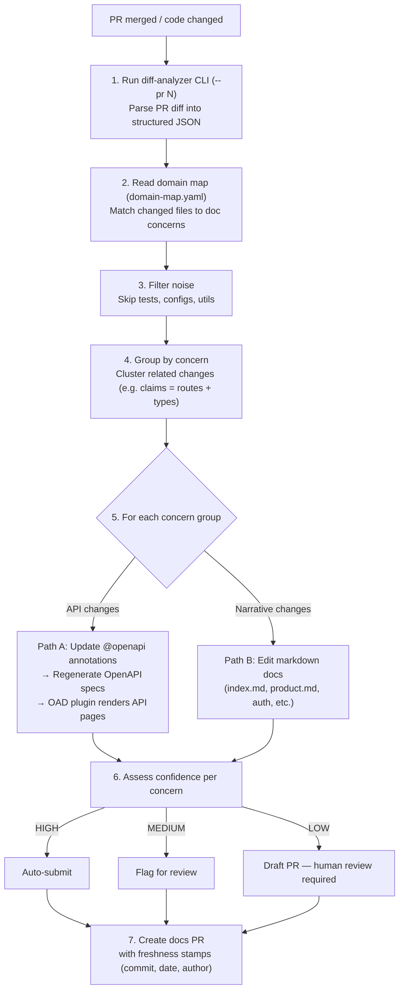

# Doc-Update Agent — MVP

An automated system that keeps API documentation in sync with code changes. When engineers modify endpoints, the agent detects the changes, updates annotations and docs, regenerates OpenAPI specs, and creates a PR — so docs never fall behind.

Built for internal teams tired of outdated API docs.

**Live docs:** [https://crm-api-generator-iymkmkjb.devinapps.com](https://crm-api-generator-iymkmkjb.devinapps.com)

---

## How to Install

You don't. Devin works out of the box in your codebase — just like any other engineer. Point it at a repo, give it a PR, and it handles the rest. No plugins, no CI config, no infrastructure to maintain.

---

## How the Agent Works



---

## Running the Agent

Start a Devin session and type:

```
!doc-update PR#<number>
```

The agent handles everything from there — analyzes the diff, updates docs, regenerates specs, and creates a PR.

---

## What's in the Box

| Component | Purpose |
|-----------|---------|
| **Diff Analyzer CLI** | Parses PR diffs into structured JSON with a deterministic action plan |
| **Domain Map** (`domain-map.yaml`) | Maps source files → doc pages → OpenAPI specs |
| **Skills** | Grounded annotation patterns (Express JSDoc, Spring Boot, language quality) |
| **Playbook** (`!doc-update`) | Orchestration prompt — the agent's full procedure |
| **GitHub Actions trigger** | Auto-runs the agent on PR merge |

---

## Key Design Decisions

- **Annotations live with the code** — not in separate doc files. Any engineer (or agent) editing the code keeps docs in sync.
- **Deterministic where possible, agentic where needed** — the CLI computes which specs to regenerate and which files are unmapped. The agent decides how to group concerns and write annotations.
- **Confidence-based output** — HIGH auto-submits, MEDIUM flags for review, LOW creates a draft PR.
- **Zero infrastructure** — no plugins, no CI config, no doc platform to maintain. Just Devin + your repo.

---

*For running the demo services locally, see [RUNNING-DEMO.md](RUNNING-DEMO.md).*
