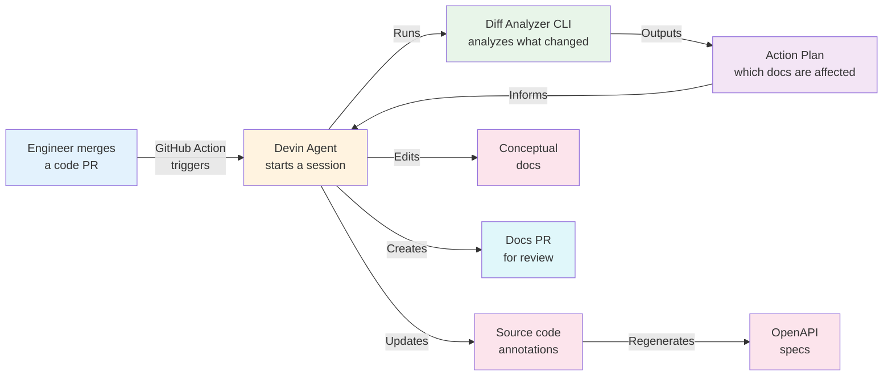

# Doc-Update Agent

A reactive agent that keeps API documentation in sync with code changes. When an engineer merges a PR, a GitHub Action triggers a Devin session that analyzes the diff, updates annotations and docs, regenerates OpenAPI specs, and opens a docs PR — so documentation never falls behind.

**Live docs:** [https://crm-api-generator-iymkmkjb.devinapps.com](https://crm-api-generator-iymkmkjb.devinapps.com)

**Demo video:** [Watch on Loom](https://www.loom.com/share/ef3c64dbd53446329fb0e3365ad43afc)

---

## Architecture



**The flow:**

1. An engineer merges a code PR
2. A GitHub Action triggers a Devin session
3. The agent runs the **Diff Analyzer CLI** — a deterministic tool that parses the PR diff, maps changed files to documentation concerns via a domain map, and outputs a structured action plan (which specs to regenerate, which docs are affected, which files are unmapped)
4. The agent uses the action plan to update source code annotations, edit conceptual docs, and regenerate OpenAPI specs
5. The agent creates a docs PR with a confidence label (HIGH/MEDIUM/LOW) and a structured review guide

The key design principle: **deterministic where possible, agentic where needed.** The CLI handles diff parsing and concern mapping with tested, reproducible logic. The agent handles the creative work — writing annotations, editing prose, and making judgment calls.

---

## Where to Look

| What you're looking for | Where to find it |
|---|---|
| **Agent orchestration prompt** | [`.agents/playbooks/doc-update.md`](.agents/playbooks/doc-update.md) — the full playbook that drives the agent end-to-end |
| **Diff Analyzer CLI** | [`tools/diff-analyzer/`](tools/diff-analyzer/) — TypeScript CLI with 100+ unit tests |
| **Domain mapping** | [`docs/domain-map.yaml`](docs/domain-map.yaml) — maps source files to doc pages and OpenAPI specs |
| **Skills (annotation patterns)** | [`.agents/skills/`](.agents/skills/) — grounded writing examples for Express, Java, annotation quality |
| **OpenAPI spec generation** | [`scripts/generate-openapi-specs.sh`](scripts/generate-openapi-specs.sh) — starts servers, fetches live specs |
| **GitHub Actions trigger** | [`.github/workflows/doc-update.yml`](.github/workflows/doc-update.yml) — kicks off the agent on PR merge |
| **MkDocs site config** | [`docs/mkdocs.yml`](docs/mkdocs.yml) — documentation site with shadcn theme + OAD plugin |
| **Mock services** | [`javascript/`](javascript/) (Express) and [`java/`](java/) (Spring Boot) — the CRM API codebase |

---

## The Reactive Agent

The agent is triggered automatically when code changes land. It doesn't run on a schedule — it reacts to PR merges.

**What it does per run:**
- Parses the PR diff to understand what changed (deterministic, via CLI)
- Groups changes by domain concern (e.g., "claims" = routes + types + tests)
- Writes or updates `@openapi` JSDoc / `@Operation` annotations in source code
- Regenerates OpenAPI specs from live servers
- Updates conceptual docs (product overview, auth, guides)
- Stamps each doc page with freshness metadata (commit, date, author)
- Creates a docs PR with a structured description and confidence assessment

**Confidence-based output:**
- **HIGH** — auto-submits (routine annotation additions)
- **MEDIUM** — flags for review with a review guide explaining what to check
- **LOW** — opens as draft PR, requires human review

---

## Diff Analyzer CLI

A deterministic TypeScript CLI that parses PR diffs into structured JSON. This is the foundation that makes the agent reliable — instead of asking an LLM to "figure out what changed," we compute it.

**What it outputs:**
- `files[]` — each changed file with classification, hunks, and domain matches
- `actionPlan.affectedSpecs` — which OpenAPI specs need regeneration
- `actionPlan.unmappedFiles` — files not yet in the domain map
- `actionPlan.hasNewController` — whether a new controller was added
- `pr` — summary stats (total files, additions, deletions)

**Testing:** 100+ unit tests covering diff parsing, domain mapping, action plan generation, and edge cases. See [`tools/diff-analyzer/`](tools/diff-analyzer/) for usage and commands.

---

## Running the Agent

Start a Devin session and type:

```
!doc-update PR#<number>
```

Or let the GitHub Action trigger it automatically on PR merge.

---

## Key Design Decisions

- **Annotations live with the code** — not in separate doc files. Any engineer (or agent) editing the code keeps docs in sync.
- **Deterministic where possible, agentic where needed** — the CLI computes which specs to regenerate and which files are unmapped. The agent decides how to group concerns and write annotations.
- **Confidence-based output** — HIGH auto-submits, MEDIUM flags for review, LOW creates a draft PR.
- **Zero infrastructure** — no plugins, no CI config, no doc platform to maintain. Just Devin + your repo.

---

*For running the demo services locally, see [RUNNING-DEMO.md](RUNNING-DEMO.md).*
