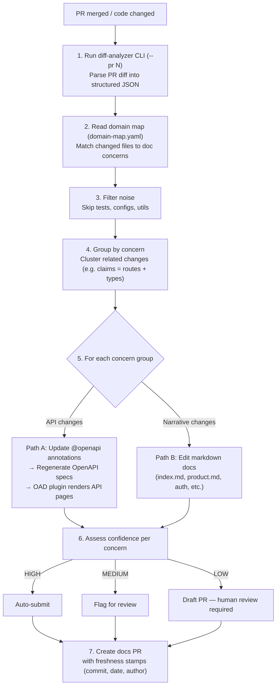

# Doc-Update Agent — MVP

An automated system that keeps API documentation in sync with code changes. When engineers modify endpoints, the agent detects the changes, updates annotations and docs, regenerates OpenAPI specs, and creates a PR — so docs never fall behind.

Built for internal teams tired of outdated API docs.

---

## How the Agent Works



---

## Running the Agent

Start a Devin session and type:

```
!doc-update PR#<number>
```

The agent handles everything from there — analyzes the diff, updates docs, regenerates specs, and creates a PR.

---

## Running Locally

### Express API (TypeScript)

```bash
cd javascript && npm install && npm run dev
# API:        http://localhost:3000
# Swagger UI: http://localhost:3000/api-docs
```

### Email Service (Java / Spring Boot)

```bash
cd java && mvn spring-boot:run
# API:        http://localhost:8080
# Swagger UI: http://localhost:8080/swagger-ui/index.html
```

### Documentation Site (MkDocs)

```bash
cd docs
pip install mkdocs mkdocs-shadcn neoteroi-mkdocs pymdown-extensions
mkdocs serve
# Docs: http://localhost:8000
```

### Generate OpenAPI Specs

```bash
./scripts/generate-openapi-specs.sh
# Output: docs/docs/specs/express-openapi.json
#         docs/docs/specs/springboot-openapi.json
```

---

## Key Design Decisions

- **Annotations live with code.** OpenAPI docs are embedded as JSDoc / `@Operation` comments in the source files, not maintained separately. Any agent that reads the code can keep docs in sync.
- **Specs are generated, not hand-written.** The `generate-openapi-specs.sh` script starts the servers, fetches live OpenAPI JSON, and commits it. The MkDocs OAD plugin renders specs into API reference pages automatically.
- **Skills ground the agent.** Skill files provide concrete BAD/GOOD examples so the agent writes consistent, high-quality annotations instead of generic LLM filler.
- **Freshness stamps track drift.** Every doc page carries a machine-readable timestamp showing when it was last updated, by whom, and from which PR.
- **Stateless by design.** Each agent run is a fresh session. All persistent context comes from files in the repo (`domain-map.yaml`, skills, specs) and Devin Knowledge Notes.
