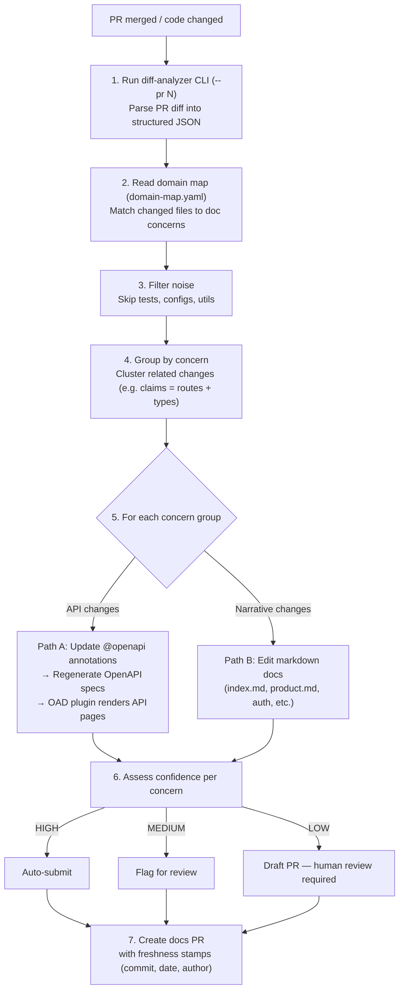

# Doc-Update Agent — MVP

An automated system that keeps API documentation in sync with code changes. When engineers modify endpoints, the agent detects the changes, updates annotations and docs, regenerates OpenAPI specs, and creates a PR — so docs never fall behind.

Built for internal teams tired of outdated API docs.

**Live docs:** [https://crm-api-generator-iymkmkjb.devinapps.com](https://crm-api-generator-iymkmkjb.devinapps.com)

**Demo video:** [Watch on Loom](https://www.loom.com/share/ef3c64dbd53446329fb0e3365ad43afc)

---

## How to Install

You don't. Devin works out of the box in your codebase — just like any other engineer. Point it at a repo, give it a PR, and it handles the rest. No plugins, no CI config, no infrastructure to maintain.

---

## How the Agent Works



---

## Who Runs What

```mermaid
flowchart LR
    A["PR merged"] --> B["GitHub Actions trigger"]
    B --> C["Devin session starts"]
    C --> D["!doc-update playbook"]
    D --> E["diff-analyzer CLI\n(deterministic)"]
    E --> F["Agent reads action plan\n+ domain map"]
    F --> G["Agent writes annotations\n+ updates docs"]
    G --> H["generate-openapi-specs.sh\n(deterministic)"]
    H --> I["Agent creates docs PR\nwith confidence label"]
```



| Step | Who | What |
|------|-----|------|
| 1. Trigger | **GitHub Actions** | Detects PR merge, starts a Devin session with `!doc-update PR#N` |
| 2. Diff analysis | **diff-analyzer CLI** | Parses the PR diff, computes action plan (which specs to regen, unmapped files) |
| 3. Concern grouping | **Devin agent** | Groups changes by domain concern using `domain-map.yaml` |
| 4. Annotation writing | **Devin agent** | Writes/updates `@openapi` JSDoc or `@Operation` annotations following skill files |
| 5. Spec regeneration | **generate-openapi-specs.sh** | Starts servers, fetches live OpenAPI specs, saves to `docs/docs/specs/` |
| 6. Doc updates | **Devin agent** | Updates narrative markdown pages (index, product, auth) |
| 7. PR creation | **Devin agent** | Creates docs PR with confidence label + review guide (if MEDIUM/LOW) |

---

## CLIs

### diff-analyzer

Parses a PR diff into structured JSON with a deterministic action plan.

```bash
cd tools/diff-analyzer && npm install

# Analyze a PR by number:
npx ts-node src/cli.ts --pr 21 --repo /path/to/repo --domain-map /path/to/repo/docs/domain-map.yaml --pretty

# Analyze a branch:
npx ts-node src/cli.ts --branch feature-branch --repo /path/to/repo --domain-map /path/to/repo/docs/domain-map.yaml --pretty

# Analyze a raw diff file:
npx ts-node src/cli.ts diff-file.txt --domain-map /path/to/repo/docs/domain-map.yaml --pretty
```

**Output includes:**
- `files[]` — each changed file with classification, hunks, and domain matches
- `pr` — summary stats (total files, additions, deletions, flags)
- `actionPlan.affectedSpecs` — which specs need regeneration
- `actionPlan.unmappedFiles` — files not in the domain map
- `actionPlan.hasNewController` — whether a new controller was added

### generate-openapi-specs.sh

Starts both servers, fetches their live OpenAPI specs, and saves them.

```bash
./scripts/generate-openapi-specs.sh
# Output: docs/docs/specs/express-openapi.json
#         docs/docs/specs/springboot-openapi.json
```

---

## Running the Agent

Start a Devin session and type:

```
!doc-update PR#<number>
```

Or let GitHub Actions trigger it automatically on PR merge.

---

## What's in the Box

| Component | Purpose |
|-----------|---------|
| **diff-analyzer CLI** | Parses PR diffs → structured JSON + deterministic action plan |
| **generate-openapi-specs.sh** | Regenerates OpenAPI specs from live servers |
| **Domain Map** (`domain-map.yaml`) | Maps source files → doc pages → OpenAPI specs |
| **Skills** | Grounded annotation patterns (Express JSDoc, Spring Boot, language quality) |
| **Playbook** (`!doc-update`) | Orchestration prompt — the agent's full procedure |
| **GitHub Actions trigger** | Auto-runs the agent on PR merge |

---

## Key Design Decisions

- **Annotations live with the code** — not in separate doc files. Any engineer (or agent) editing the code keeps docs in sync.
- **Deterministic where possible, agentic where needed** — the CLI computes which specs to regenerate and which files are unmapped. The agent decides how to group concerns and write annotations.
- **Confidence-based output** — HIGH auto-submits, MEDIUM flags for review, LOW creates a draft PR.
- **Zero infrastructure** — no plugins, no CI config, no doc platform to maintain. Just Devin + your repo.

---

*For running the demo services locally, see [RUNNING-DEMO.md](RUNNING-DEMO.md).*
