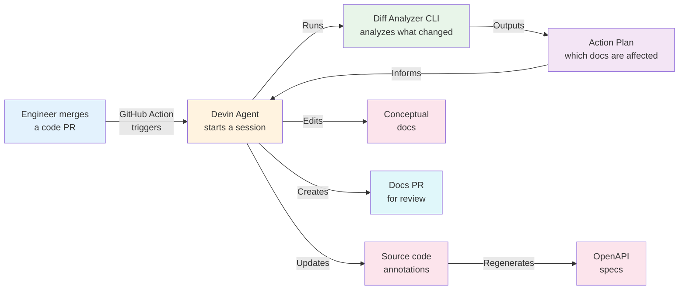
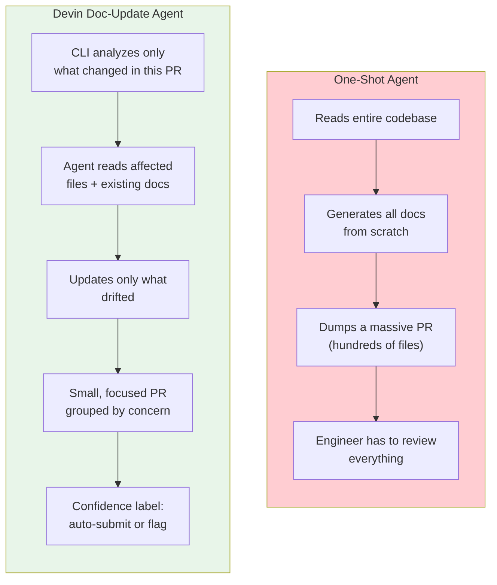
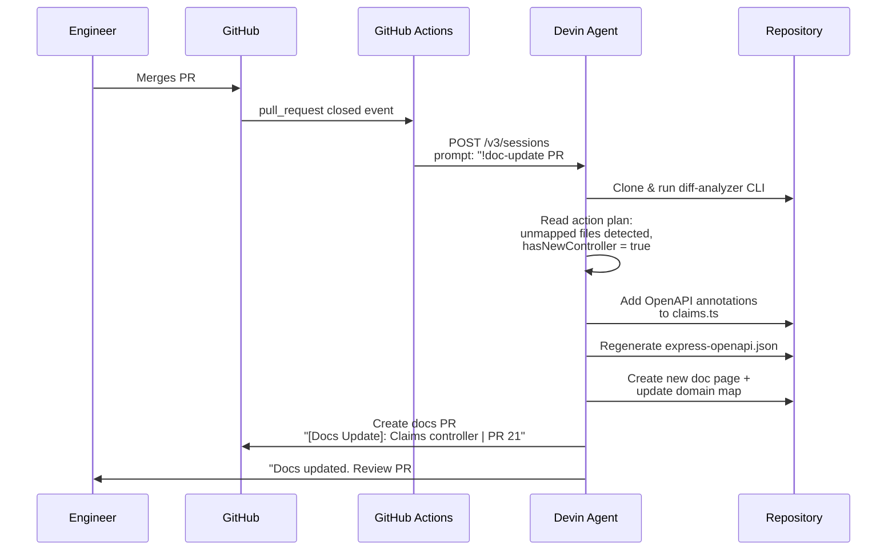

# Keeping API Docs in Sync — Automatically

### A solution for DataStack built with Devin

---

## 1. We Heard You

> *"Our API docs are six months out of date. Engineers change endpoints and never update the docs. New hires and partner teams constantly ping us asking how things work because the docs are wrong."*

**The cost of stale docs:**

| Who's affected | Impact |
|---------------|--------|
| New hires | Onboarding takes 2-3x longer — they read the docs, try something, it fails, they ping someone |
| Partner teams | Integration delays — they build against the wrong API shape |
| Senior engineers | Constant interruptions answering "how does this actually work?" |
| The business | Tribal knowledge risk — if the people who know leave, the knowledge leaves too |

**The root cause isn't laziness — it's workflow.**  
Docs live in a separate place from code. Updating them is a separate task. And separate tasks get cut from sprints.

---

## 2. Our Approach: Automation on Every PR Merge

Every time a code PR is merged, a Devin agent session kicks off automatically — no engineer action needed.

**Two types of doc updates, handled differently:**

| Type | How it works | Example |
|------|-------------|---------|
| **API reference** | Agent updates source code annotations → specs auto-regenerate → docs render automatically | New endpoint added, request shape changed, error codes updated |
| **Conceptual docs** | Agent reads the code change and edits markdown directly, using judgment | Auth flow changed, new feature added, architecture shifted |

**The result:** Engineers get a docs PR to review — not to write. They approve or leave a comment. That's it.

---

## 3. What Makes Devin Unique

Other coding agents can generate docs from a prompt. Here's why that's not enough, and what Devin does differently:

| | One-shot agent | Devin doc-update |
|---|---|---|
| **Scope** | Entire codebase | Only what changed in this PR |
| **Output** | One massive PR | Small, focused PR per merge |
| **Quality** | Generic — no style consistency | Follows skill files — consistent voice |
| **Review burden** | Engineer reviews hundreds of changes | Engineer reviews only the delta |
| **Confidence** | No signal on what's reliable | HIGH / MEDIUM / LOW per concern |
| **Trigger** | Manual — someone has to remember | Automatic — every PR merge |

**Key differentiators:**

- **Playbooks & skills** — the agent follows written standards for annotation style, not ad-hoc LLM output
- **Confidence routing** — HIGH confidence changes auto-submit; LOW confidence drafts get flagged for human review
- **Incremental** — never regenerates everything; only touches what drifted
- **Domain map** — a YAML file maps code files → doc pages → API specs, so the agent knows exactly where to look

---

## 4. We Built the Opinion Using Devin

This isn't a theoretical architecture. Every piece of this system was designed, built, and tested inside Devin sessions:

| Component | What it does | Built with Devin? |
|-----------|-------------|-------------------|
| **Diff Analyzer CLI** | Parses git diffs, maps to domain, outputs action plan | Yes — TypeScript, 109 unit tests |
| **Domain Map** | YAML config mapping code → docs → specs | Yes — seeded and iterated |
| **Annotation Skills** | Writing standards for OpenAPI annotations | Yes — grounded examples from real PRs |
| **Playbook** | 9-step orchestration prompt for the agent | Yes — refined over multiple test runs |
| **GitHub Actions** | Auto-trigger on PR merge | Yes — workflow file in repo |
| **MkDocs site** | Live docs with auto-rendered API reference | Yes — neoteroi OAD plugin integration |

**Devin wasn't just the runtime — it was the development tool.** We used Devin to build the system that Devin runs.

---

## 5. Live Demo

### The trigger

A PR merges that adds a new Claims controller with no documentation:

### What the agent produces

1. **OpenAPI annotations** added to the source code (living with the code, not separate)
2. **API spec regenerated** — only the affected spec, not all of them
3. **New doc page** created with auto-rendered endpoint tables
4. **Domain map updated** — the new controller is now tracked
5. **Freshness stamps** on every touched page — you always know when docs were last verified
6. **Confidence report** — the agent tells you how sure it is about each change

### What engineers see

A small, focused PR titled `[Docs Update]: Claims controller | PR 21` with:
- Annotation changes in the source file they already know
- A new doc page they can glance at
- A confidence label telling them if this needs careful review or is rubber-stamp ready

---

## 6. Next Steps

### Immediate: Catch up from 6 months of drift

| Week | Action | Outcome |
|------|--------|---------|
| **1** | Connect Devin to your repo. Audit current doc coverage against codebase. Seed the domain map. | Clear picture of what's stale and what's missing |
| **1-2** | Run the agent on your last 5-10 merged PRs to generate the backlog of doc updates | Docs go from 6 months stale to current |

### Pilot: Prove it on one team

| Week | Action | Outcome |
|------|--------|---------|
| **2-4** | Enable auto-trigger on one team's repo. Tune annotation skills to match your doc voice. | Docs stay current automatically for that team |
| **4** | Measure: what % of doc PRs get approved without edits? | Baseline for quality and trust |

### Rollout: Scale across the org

| Phase | Action | Outcome |
|-------|--------|---------|
| **Expand** | Roll out to all repos. Onboard partner-facing API docs. | Consistent docs org-wide |
| **Freshness SLAs** | Any doc page older than 30 days gets auto-flagged | No more silent drift |
| **Governance** | Confidence routing: HIGH → auto-merge, MEDIUM → tech writers, LOW → PR author | Right level of review for each change |

### The end state

Engineers never write docs manually again. Every PR merge triggers an update. New hires read docs that match the code. Partners integrate against accurate API references. And you have a dashboard showing exactly which docs are fresh and which need attention.

---

*Built with Devin by Cognition*
