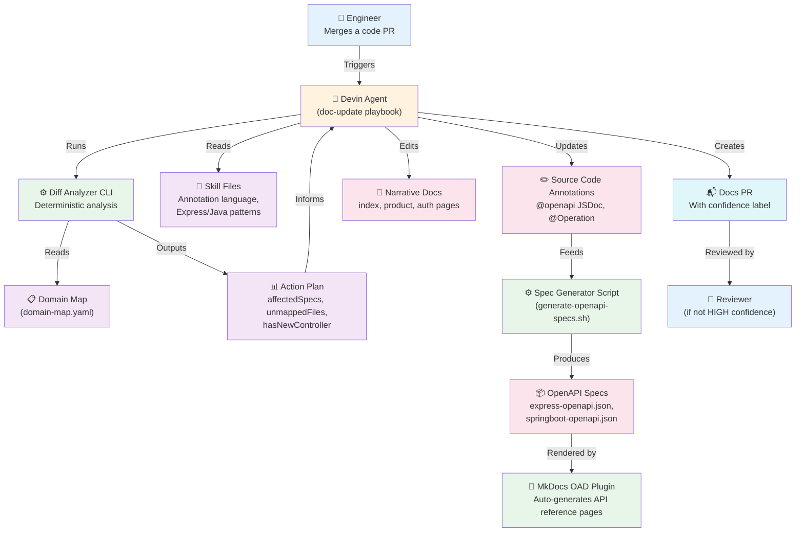

# Doc-Update Agent — Flow Map

## System Flow

---

## Stakeholder Roles

| Stakeholder | Role | When Involved |
|-------------|------|---------------|
| **Engineer** | Merges code PRs that change API endpoints or business logic | Triggers the agent; reviews docs PR if confidence is MEDIUM/LOW |
| **Devin Agent** | Orchestrates the full flow — reads analysis, writes annotations & docs, creates PR | Runs the playbook end-to-end |
| **Diff Analyzer CLI** | Pre-computes what changed and what needs updating (deterministic) | Called by agent early on; outputs structured JSON with action plan |
| **Domain Map** | Source of truth mapping code files → doc pages → specs | Read by CLI and agent; updated by agent when new controllers appear |
| **Skill Files** | Define writing style, annotation patterns, and domain-map rules | Read by agent before writing any content |
| **Spec Generator Script** | Starts servers, fetches live OpenAPI specs, saves to disk | Run by agent only for specs listed in affectedSpecs |
| **MkDocs OAD Plugin** | Auto-renders API reference pages from OpenAPI spec files | Runs at build time — no manual work needed |
| **Reviewer** | Human who reviews the docs PR when confidence is not HIGH | Only involved when agent flags uncertainty |

---

## What's Deterministic vs. Agent Decision

| Deterministic (CLI / Scripts) | Agent Decides (LLM) |
|-------------------------------|---------------------|
| Which files changed | How to group files into concerns |
| Which specs need regeneration | Which update path per group (A/B/both) |
| Which files are unmapped | What to write in annotations & docs |
| Whether there's a new controller | Confidence assessment per group |
| Noise filtering | Whether to auto-submit or flag for review |
