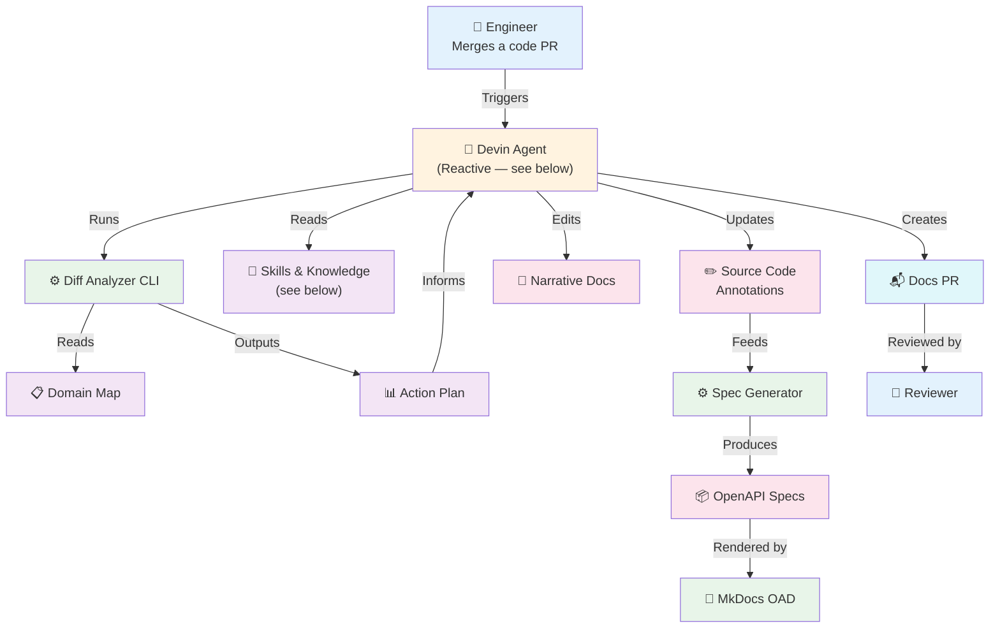
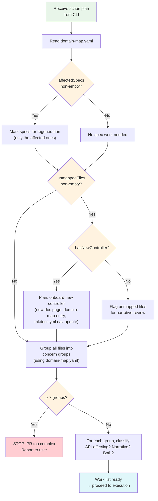
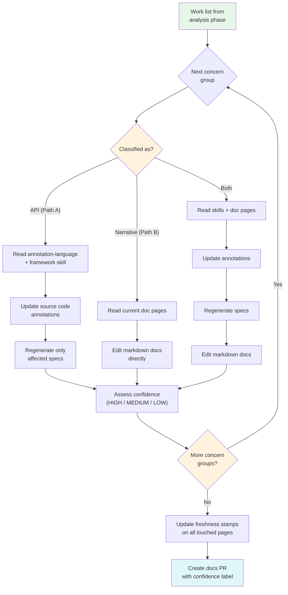
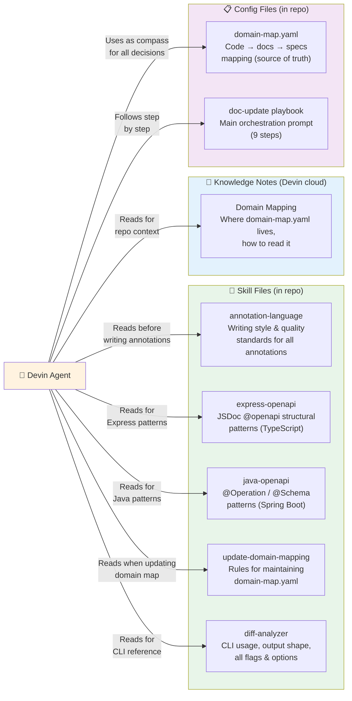

# Doc-Update Agent — Overview

## 1. System Flow (High Level)

---

## 2. Agent Figures Out What to Update

The agent reads the action plan from the CLI and builds a work list. This is the **analysis phase** — no files are modified yet.

---

## 3. Agent Executes Updates

With the work list ready, the agent processes each concern group. This is the **execution phase** — files are read and modified.

---

## 4. Skills & Knowledge Base

The agent's context comes from two sources: **skill files** (in-repo, versioned) and **knowledge notes** (Devin cloud, org-scoped).

**Skill files** are read by the agent at specific moments during execution — they define _how_ to write, not _what_ to write. The agent reads annotation-language first (quality bar), then the relevant framework skill (Express or Java) for structural patterns.

**Knowledge notes** provide org-level context that persists across sessions. Currently minimal (just domain-map location), but designed to grow as the system handles more repos.

---

## 5. What's Deterministic vs. Agent Decision

| Deterministic (CLI / Scripts) | Agent Decides (LLM) |
|-------------------------------|---------------------|
| Which files changed | How to group files into concerns |
| Which specs need regeneration | Which update path per group (A/B/both) |
| Which files are unmapped | What to write in annotations & docs |
| Whether there's a new controller | Confidence assessment per group |
| Noise filtering | Whether to auto-submit or flag for review |
